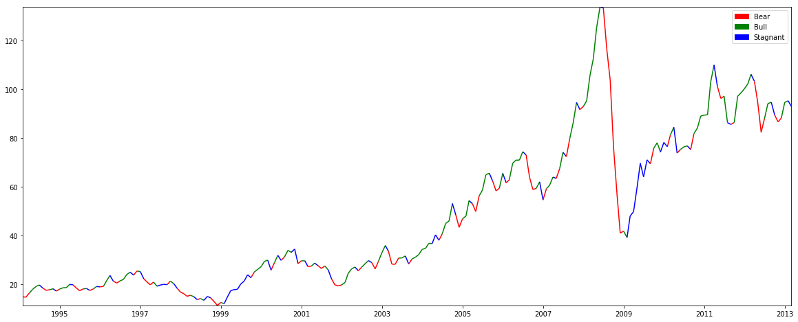
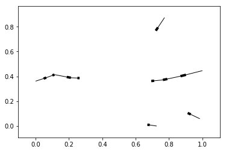

# Implementation
============================
#### (Using Probabilistic Graphical Models to forecast the price of crude oil)

The document contains the **implementation** of the oil trading system using graphical models.

* [The **first** part](#first) is dedicated to retrieving data from the **EIA** and **FRED**, **preprocessing** the data,and creating the **training**, **validation**, and **test** datasets.
* [The **second** part](#second) is dedicated to implementing a **regime detection model** using **Hidden Markov Models** to identify bull, bear, and stagnant regimes
* [The **third** part](#third) is dedicated to learning the **macroeconomic structure** of the oil markets by **learning the belief network** using **hill-climbing** structural learning.
* [The **fourth** part](#fourth) is dedicated to **testing** the constructed model by simulating trades and taking positions based on those trades.

It is recommended to take look at the thesis documentation to understand the basis on which we selected the macroeconomic economic data from the EIA and FRED, and the theoretical context of the graphical models being employed in our model. 

We would be using a number of Python packages, such as [pgmpy](http://pgmpy.org/) and [hmms](https://github.com/lopatovsky/HMMs) throughout the notebook and it is highly recommended that we take a deeper look at them as only a specific and relevant functionality of those packages have been used in our model.

## Data preprocessing

Data preprocessing plays an important role in Machine Learning. Our data preprocessing has four main steps;  data retrieval, data cleaning, data transformation, and data discretisation.

### Data retrieval

The first step of constructing our model is to retrieve the data from the open-data facilities. We have selected the **EIA** and **FRED** as our primary data sources. Unfortunately, both these open-data facilities do not provide Python packages to neatly retrieve data in Python, so we will have to resort to using third-party APIs. For the EIA, we are using [EIA-python](https://github.com/mra1385/EIA-python/), and for the FRED we are using [fredapi](https://github.com/mortada/fredapi). 

Before beginning, we would be first be importing pandas and numpy, as they are highly required in the entire data preprocessing section.


```python
import pandas as pd # pandas is an open source, data structures and data analysis tool in Python
import numpy as np  # numpy is a Python library supporting high-level mathematical functions on large multidimensional arrays
```

We would now be retrieving data, beginning with the EIA. Before retrieving data from the EIA, we have to register with EIA's [open-data facility](https://www.eia.gov/opendata/), in return of which we shall recieve an API key, which is used as a passphrase to access data from the EIA's datacenter. 


```python
import eia # Importing the library
eia_key = "265d1f2178aaab3ceec3d364d9cc1d11"; # the API key we recieved from EIA
eia_api = eia.API(eia_key); # Initiates a session with the EIA datacenter to recieve datasets
```

Now, we shall be making a request to retrieve data from the EIA as a pandas dataframe. EIA provides a 3,872 Short-Term Energy Outlook (STEO) datasets, with short-term (2-year) forecasts of each dataset. These datasets can be searched in EIAs [query browse](https://www.eia.gov/opendata/qb.php) facility, which also offers a catalogue of different datasets sorted by relevance. Just as an example to demonstrate, we would be retrieving the **Crude Oil Exports, Monthly**, which has a Series ID '**TOTAL.COEXPUS.M**'.


```python
eia_data = pd.DataFrame(eia_api.data_by_series(series='TOTAL.COEXPUS.M')); # Convert to pandas dataframe
```

### Data Cleaning

Taking a look at the dataframe, we can observe some evident inconsistencies. 

Firstly, the dataframe provided by the EIA is not of the standard format **datetime**, which pandas indexing supports and provides extensive facility to. We would be writing a function which makes the index a **datetime** object so that we can convert the dataframe to a **datetime**-index dataframe for more compatibility with pandas, hmms, and pgmpy.


```python
import datetime # Using the datetime library

def convert_to_datetime(input):
            return datetime.datetime.strptime(input[:9], "%Y %m ").date();

eia_data.index = eia_data.index.map(convert_to_datetime); # Apply to entire index
eia_data.index = pd.to_datetime(eia_data.index); # Convert dataframe index to datetime64[ns] index
eia_data.columns = ['TOTAL.COEXPUS.M']; # pgmpy stores the column names as the variable name
```

The second issue are **holes** in the data i.e. rows marked by a '-' (a single dash). We would be replacing these dashes by **np.nan** so that we can use pandas to fill in the holes. Usually the prevalance of these holes is very rare, but just to be on the safe side to ensure we can possibly download every dataset.


```python
eia_data.replace('-', np.nan, regex=True, inplace=True); # Replace the '-' with np.nan
eia_data.fillna(method='bfill', inplace=True); # Backward fill the holes, by filling them with the data infront.
```

Together, we can create a function carrying out the entire process so that we can easily clean EIA data in one step.


```python
def clean_EIA(data):
            data.replace('-', np.nan, regex=True, inplace=True);
            data.fillna(method='bfill', inplace=True);
            
            data.index = data.index.map(convert_to_datetime);
            data.index = pd.to_datetime(data.index);
```

The dataframe is now a time series dataframe which could be plotted as a time-series dataframe.


```python
import matplotlib.pyplot as plt

fig, ax = plt.subplots(figsize=(20,6));
ax.plot(eia_data);
```

Now, we shall be taking a look at the FRED data. Similar to [EIA-python](https://github.com/mra1385/EIA-python/), the [fredapi](https://github.com/mortada/fredapi) requires us to register with [FRED API](https://research.stlouisfed.org/docs/api/fred/) so that we can access data. We would download the **Spot Crude Oil Price: West Texas Intermediate**, having the Series ID '**WTISPLC**.'


```python
from fredapi import Fred

fred_key = "029c72315e9ec4eaf3e679ec3f6a2cb3"; # FRED API key
fred = Fred(api_key=fred_key); # Initiates a session with the FRED datacenter to recieve datasets

fred_data = pd.DataFrame(fred.get_series('WTISPLC'), columns=['WTISPLC']); # Retrieve data from FRED API
```

It is evident that the FRED, though still being a government organization, has 'ready-to-use' / 'plug'n play' data of useable quality compared to the EIA. Fortuntely, we will not be having to clean data obtained from the FRED.


### Constructing the training, validation and testing datasets (Data transformation)

As mentioned in the thesis, we need to divide our data in three portions: the training dataset, the validation dataset, and the training dataset. Given that we would be using a number of datasets from the FRED and the EIA, we would have to amalgamate these datasets into one dataframe and then slice the dataframe accordingly. 

The train, validation, and test datasets are to be observed with a ratio of $80:10:10$, which is a popular ettiquette  

The choice of datasets has been described in the thesis.


```python
# Dataset series ID from the EIA

datasets_eia  = [
    
                        'STEO.RGDPQ_NONOECD.M',
                        'STEO.RGDPQ_OECD.M',
    
                        'STEO.PAPR_NONOPEC.M',
                        'STEO.PAPR_OPEC.M',
    
                        'STEO.PATC_OECD.M',
                        'STEO.PATC_NON_OECD.M',
                
    
                        'STEO.COPRPUS.M',
                        'STEO.CORIPUS.M',
                        'PET.MCRIMXX2.M',
                        
                        'STEO.FOREX_WORLD.M',
    
                        'STEO.PASC_OECD_T3.M',
    
                        'STEO.COPS_OPEC.M',
                        'STEO.COPC_OPEC.M',
    
                        'STEO.T3_STCHANGE_OOECD.M',
                        'STEO.T3_STCHANGE_NOECD.M',
                ];

# Dataset series ID from the FRED

datasets_fred = [
                        'CPIENGSL',
                        'CAPG211S',
                        'CAPUTLG211S',
                        'IPG211S',
                        'IPG211111CN',
                        'INDPRO',
                        'IPN213111N',
                        'PCU211211',
                
                ];
```

To construct the training, validation, and testing datasets, we need to first **concatenate** the datasets into one dataframe, and then slice it.


```python
data_merge = []; # List of dataframes to be concatenated

# Adding EIA datasets 

for series_id in datasets_eia:
        df = pd.DataFrame(eia_api.data_by_series(series=series_id));
        clean_EIA(df);
        df.columns = [series_id];   
        data_merge.append(df);

# Adding FRED datasets 

for series_id in datasets_fred:
        df = pd.DataFrame(fred.get_series(series_id), columns=[series_id]);
        data_merge.append(df);
```

We have to create two additional columns; one which has the current crude oil price, and the other for the price of crude oil next month (forecast). This will be used to forecast the price of oil and hence allow us to make buy/sell decisions based on that forecast. 


```python
datasets = datasets_eia + datasets_fred + ['WTISPLC', 'forecast'];

current =  pd.DataFrame(fred.get_series('WTISPLC'), columns=['WTISPLC']);
forecast = pd.DataFrame(fred.get_series('WTISPLC').shift(-1), columns=['forecast']);

data_merge.append(current);
data_merge.append(forecast);
```

We have to amalgamate all datasets together in a single dataframe, therefore we would use the pandas **concatenate** function. This would allow us to find the intersection of the date intervals of all dataframes and construct a single dataframe on a common time interval. 


```python
data = pd.concat(data_merge, axis=1, join='inner');
```

Slicing our dataframe in train, validation, and testing datasets,


```python
train_data = data[: int(data.shape[0] * 0.80)];
vald_data = data[int(0.80 * data.shape[0]) : int(0.90 * data.shape[0])];
test_data = data[int(0.90* data.shape[0]) : int(data.shape[0])];
```

### Data Discretisation

The data we have collected is non-categorical data; it is unlabelled and continuous. Belief networks have variables, each having discrete **states**, and therefore we have to reduce our data from prices to a set of states, such as bull, bear, and stagnant markets. In order to detect these (hidden) states, we have to use graphical models called **Hidden Markov Models**. The process of detecting hidden states in time-series data is called **Regime Detection**.

## Regime Detection

We would be using Python library called [hmms](https://github.com/lopatovsky/HMMs) for implementing the **Hidden Markov Models**.

A **Hidden Markov Model** is a 5-tuple $(Q, \sum, \Pi, A, B)$, where $Q = \{q_{1}, \cdots, q_{N}\}$ is a finite set of $\mathcal{N}$ states, $\sum = \{s_1, \cdots, s_{N}\}$ is the set of $\mathcal{M}$ possible symbols (emissions) in the language, $\Pi = \{\pi_{i}\}$  is the initial probability vector, $A = \{a_{ij}\}$ is the state transition probability matrix, and $B = \{b_i(v_k)\}$ is the emission probability matrix. The HMM can be denoted by $\lambda = (\Pi, A, B)$.

For detecting regimes in time-series data, we would be using **Hidden Markov Models**, with the difference between consecutive months being the symbols $\sum$ (1 - increase / 0 - decrease), the hidden states, $Q$ being the **bull**, **bear**, **stagnant** market regimes. 

Let us use '**WTISPL**' (Spot Crude Oil Price: West Texas Intermediate)  of  and try to identify regimes in the time series. 


```python
import hmms
```


```python
price = train_data['WTISPLC'];
```

We will now try to transform the time series which represents the output emissions, with $1$ representing an increase in the price from the previous month and $0$ representing a decrease in the price of the oil. 


```python
price_diff = price.diff()[1:]; # The first value is NaN as there is not a previous month to compare with
e_seq = np.array(price_diff.apply(lambda x: 1 if x > 0 else 0).values); # Replacing the change with 1 if positive, else 0
```

Given that we have obtained the output (observed emission sequence), we can now use the **Baum-Welch algorithm** to learn the parameters of the HMM generating this data. 

We have earlier described the **Baum-Welch algorithm** in the Background and Literature review, and we would be using the implementation provided [hmms](https://github.com/lopatovsky/HMMs) to learn the parameters.

**IT IS VERY IMPORTANT** to note we can **only** use the training data to train the HMM as we are assuming to be blind to the testing data. However, we would be observing predictions on the validation dataset and will tune our model to fit it, and we would be using the testing dataframe to test the final performance of the tuned model after validation.

We will create a model with random parameters, that will be eventually trained to match the data - a discrete time HMM of three hidden states (bull, bear, or stagnant) and two output variables (increase or decrease).


```python
dhmm_r = hmms.DtHMM.random(3 , 2); 
```

Given that the $\texttt{hmms.DtHMM}$ takes a list of arrays no creater than length $32$, we will have to split our array in arrays each of length $32$ or less.


```python
e_seq = np.array_split(e_seq, 32);
```

### Baum-Welch Algorithm

We would now be using the **Baum-Welch algorithm** to learn the parameters of the HMM generating the time-series.

The probability of the reestimated model after each iteration should ideally be closer that the (unknown) generator's model, however chances might be the estimation fell in the local optima. 

Unfortunately, the financial time-series data do not have fixed parameters, so the HMM has to be trained everytime when live-trading, when using the **k-fold cross-validation** training method.


```python
dhmm_r.baum_welch(e_seq, 100); # 100 iterations
```

    iteration  1 / 100
    iteration  2 / 100
    iteration  3 / 100
    iteration  4 / 100
    iteration  5 / 100
    iteration  6 / 100
    iteration  7 / 100
    iteration  8 / 100
    iteration  9 / 100
    iteration  10 / 100
    iteration  11 / 100
    iteration  12 / 100
    iteration  13 / 100
    iteration  14 / 100
    iteration  15 / 100
    iteration  16 / 100
    iteration  17 / 100
    iteration  18 / 100
    iteration  19 / 100
    iteration  20 / 100
    iteration  21 / 100
    iteration  22 / 100
    iteration  23 / 100
    iteration  24 / 100
    iteration  25 / 100
    iteration  26 / 100
    iteration  27 / 100
    iteration  28 / 100
    iteration  29 / 100
    iteration  30 / 100
    iteration  31 / 100
    iteration  32 / 100
    iteration  33 / 100
    iteration  34 / 100
    iteration  35 / 100
    iteration  36 / 100
    iteration  37 / 100
    iteration  38 / 100
    iteration  39 / 100
    iteration  40 / 100
    iteration  41 / 100
    iteration  42 / 100
    iteration  43 / 100
    iteration  44 / 100
    iteration  45 / 100
    iteration  46 / 100
    iteration  47 / 100
    iteration  48 / 100
    iteration  49 / 100
    iteration  50 / 100
    iteration  51 / 100
    iteration  52 / 100
    iteration  53 / 100
    iteration  54 / 100
    iteration  55 / 100
    iteration  56 / 100
    iteration  57 / 100
    iteration  58 / 100
    iteration  59 / 100
    iteration  60 / 100
    iteration  61 / 100
    iteration  62 / 100
    iteration  63 / 100
    iteration  64 / 100
    iteration  65 / 100
    iteration  66 / 100
    iteration  67 / 100
    iteration  68 / 100
    iteration  69 / 100
    iteration  70 / 100
    iteration  71 / 100
    iteration  72 / 100
    iteration  73 / 100
    iteration  74 / 100
    iteration  75 / 100
    iteration  76 / 100
    iteration  77 / 100
    iteration  78 / 100
    iteration  79 / 100
    iteration  80 / 100
    iteration  81 / 100
    iteration  82 / 100
    iteration  83 / 100
    iteration  84 / 100
    iteration  85 / 100
    iteration  86 / 100
    iteration  87 / 100
    iteration  88 / 100
    iteration  89 / 100
    iteration  90 / 100
    iteration  91 / 100
    iteration  92 / 100
    iteration  93 / 100
    iteration  94 / 100
    iteration  95 / 100
    iteration  96 / 100
    iteration  97 / 100
    iteration  98 / 100
    iteration  99 / 100
    iteration  100 / 100


We have now learnt the parameters generating the emission sequence.


```python
hmms.print_parameters( dhmm_r );
```

    Initial probabilities (π) :


<div>
<table border="1" class="dataframe">
  <thead>
    <tr style="text-align: right;">
      <th></th>
      <th>0</th>
    </tr>
  </thead>
  <tbody>
    <tr>
      <th>0</th>
      <td>0.695329</td>
    </tr>
    <tr>
      <th>1</th>
      <td>0.177620</td>
    </tr>
    <tr>
      <th>2</th>
      <td>0.127051</td>
    </tr>
  </tbody>
</table>
</div>


    Transition probabilities matrix (A):


<div>
<table border="1" class="dataframe">
  <thead>
    <tr style="text-align: right;">
      <th></th>
      <th>0</th>
      <th>1</th>
      <th>2</th>
    </tr>
  </thead>
  <tbody>
    <tr>
      <th>0</th>
      <td>0.572717</td>
      <td>0.359354</td>
      <td>0.067928</td>
    </tr>
    <tr>
      <th>1</th>
      <td>0.085750</td>
      <td>0.372324</td>
      <td>0.541926</td>
    </tr>
    <tr>
      <th>2</th>
      <td>0.784855</td>
      <td>0.158842</td>
      <td>0.056303</td>
    </tr>
  </tbody>
</table>
</div>


    Emission probabilities matrix (B):


<div>
<table border="1" class="dataframe">
  <thead>
    <tr style="text-align: right;">
      <th></th>
      <th>0</th>
      <th>1</th>
    </tr>
  </thead>
  <tbody>
    <tr>
      <th>0</th>
      <td>0.090503</td>
      <td>0.909497</td>
    </tr>
    <tr>
      <th>1</th>
      <td>0.971681</td>
      <td>0.028319</td>
    </tr>
    <tr>
      <th>2</th>
      <td>0.240093</td>
      <td>0.759907</td>
    </tr>
  </tbody>
</table>
</div>


### Viterbi Algorithm

Now, given we now have parameters $\lambda$ and the emitted observation sequence $\texttt{e_seq}$, we can use the **Viterbi Algorithm** to identify the most likely **state-transition** path (i.e. **market regimes**) in the financial time-series. 


```python
( log_prob, s_seq ) =  dhmm_r.viterbi(np.concatenate(e_seq).ravel());
```

### Multicolored time series plot

Now, we will be plotting this graph in a **multicolored** time-series plot to observe how well the regimes have been identified.

First, we will have to make a dataframe which has the both the price and the associated regime the time-series data is in.


```python
price_plot = pd.DataFrame(price[1:], index=price[1:].index); # Add price
price_plot['Regime'] = s_seq; # Add a column representing the regime 
price_plot['diff'] = price_diff; # Add a column representing the increase or decrease in price
```

We do not know, however, which state represents which regime. Given that the bull regimes should have a high positive change in price, bear regimes should have a high negative change, and stagnant regimes are closer to zero, we can use these properties to tell which state represents which regime.


```python
means = price_plot.groupby(['Regime'])['diff'].mean(); # Get means of all assigned states
lst_1 = means.index.tolist();
lst_2 = means.sort_values().index.tolist();

map_regimes = dict(zip(lst_2, lst_1));

price_plot['Regime'] = price_plot['Regime'].map(map_regimes);
```

Plotting the data as **multi-colored** time series:


```python
import matplotlib.dates as mdates
import matplotlib.patches as mpatches
from matplotlib.collections import LineCollection
from matplotlib.colors import Colormap, ListedColormap, BoundaryNorm

fig, ax1 = plt.subplots(figsize=(20,8));
ax.plot(price_plot['WTISPLC']);

cmap   = ListedColormap(['r','b','g'],'indexed'); # Make 0 (Bear) - red, 1 (Stagnant) - blue, 2 (Bull) - green 
norm   = BoundaryNorm(range(3 + 1), cmap.N);
inxval = mdates.date2num(price_plot['WTISPLC'].index.to_pydatetime());
points = np.array([inxval, price_plot['WTISPLC']]).T.reshape(-1, 1, 2);
segments = np.concatenate([points[:-1], points[1:]], axis=1);

lc = LineCollection(segments, cmap=cmap, norm=norm);
lc.set_array(price_plot['Regime']);
plt.gca().add_collection(lc);
plt.xlim(price_plot['WTISPLC'].index.min(), price_plot['WTISPLC'].index.max());
plt.ylim(price_plot['WTISPLC'].min(), price_plot['WTISPLC'].max());

r_patch = mpatches.Patch(color='red', label='Bear');
g_patch = mpatches.Patch(color='green', label='Bull');
b_patch = mpatches.Patch(color='blue', label='Stagnant');

plt.legend(handles=[r_patch, g_patch, b_patch]);

plt.show();
```





We can observe from the graph that there are periods of bear runs, bull runs, and stagnant periods. Now, we need to apply a similar method to all the training data so that we can discretise our data and use it as an input to our belief network.

### Discretising dataframes using Hidden Markov Models 

We will write a function that trains an HMM, identifies the sequence of hidden states, and then constructs a dataframe of all the variables and stores it as training dataset.

Now, we shall apply the same method to the entire training dataset so that we can discretise it.

First, we shall learn all the parameters of Hidden Markov Models of all the variables and store them. 


```python
for series_id in datasets:
    if series_id == 'forecast':
        break;
    else:
        dhmm = hmms.DtHMM.random(3,2);
        data_diff =  train_data[series_id].diff()[1:];
        emit_seq = np.array_split(data_diff.apply(lambda x: 1 if x > 0 else 0).values, 32);
        dhmm.baum_welch(emit_seq, 100);
        path = "./hmms/" + series_id.replace(".", "_");
        dhmm.save_params(path);

# To retrain a specific dataset you were not satisfied with

# retrain_dataset = 'STEO.RGDPQ_NONOECD.M';
# dhmm = hmms.DtHMM.random(3,2);
# data_diff =  train_data[retrain_dataset].diff()[1:];
# emit_seq = np.array_split(data_diff.apply(lambda x: 1 if x > 0 else 0).values, 32);
# dhmm.baum_welch(emit_seq, 100);
# path = "./hmms/" + retrain_dataset.replace(".", "_");
# dhmm.save_params(path);

# Comment out the code above if you have already learnt HMMs and do not want to relearn them
```

    iteration  1 / 100
    iteration  2 / 100
    iteration  3 / 100
    iteration  4 / 100
    iteration  5 / 100
    iteration  6 / 100
    iteration  7 / 100
    iteration  8 / 100
    iteration  9 / 100
    iteration  10 / 100
    iteration  11 / 100
    iteration  12 / 100
    iteration  13 / 100
    iteration  14 / 100
    iteration  15 / 100
    iteration  16 / 100
    iteration  17 / 100
    iteration  18 / 100
    iteration  19 / 100
    iteration  20 / 100
    iteration  21 / 100
    iteration  22 / 100
    iteration  23 / 100
    iteration  24 / 100
    iteration  25 / 100
    iteration  26 / 100
    iteration  27 / 100
    iteration  28 / 100
    iteration  29 / 100
    iteration  30 / 100
    iteration  31 / 100
    iteration  32 / 100
    iteration  33 / 100
    iteration  34 / 100
    iteration  35 / 100
    iteration  36 / 100
    iteration  37 / 100
    iteration  38 / 100
    iteration  39 / 100
    iteration  40 / 100
    iteration  41 / 100
    iteration  42 / 100
    iteration  43 / 100
    iteration  44 / 100
    iteration  45 / 100
    iteration  46 / 100
    iteration  47 / 100
    iteration  48 / 100
    iteration  49 / 100
    iteration  50 / 100
    iteration  51 / 100
    iteration  52 / 100
    iteration  53 / 100
    iteration  54 / 100
    iteration  55 / 100
    iteration  56 / 100
    iteration  57 / 100
    iteration  58 / 100
    iteration  59 / 100
    iteration  60 / 100
    iteration  61 / 100
    iteration  62 / 100
    iteration  63 / 100
    iteration  64 / 100
    iteration  65 / 100
    iteration  66 / 100
    iteration  67 / 100
    iteration  68 / 100
    iteration  69 / 100
    iteration  70 / 100
    iteration  71 / 100
    iteration  72 / 100
    iteration  73 / 100
    iteration  74 / 100
    iteration  75 / 100
    iteration  76 / 100
    iteration  77 / 100
    iteration  78 / 100
    iteration  79 / 100
    iteration  80 / 100
    iteration  81 / 100
    iteration  82 / 100
    iteration  83 / 100
    iteration  84 / 100
    iteration  85 / 100
    iteration  86 / 100
    iteration  87 / 100
    iteration  88 / 100
    iteration  89 / 100
    iteration  90 / 100
    iteration  91 / 100
    iteration  92 / 100
    iteration  93 / 100
    iteration  94 / 100
    iteration  95 / 100
    iteration  96 / 100
    iteration  97 / 100
    iteration  98 / 100
    iteration  99 / 100
    iteration  100 / 100
    iteration  1 / 100
    iteration  2 / 100
    iteration  3 / 100
    iteration  4 / 100
    iteration  5 / 100
    iteration  6 / 100
    iteration  7 / 100
    iteration  8 / 100
    iteration  9 / 100
    iteration  10 / 100
    iteration  11 / 100
    iteration  12 / 100
    iteration  13 / 100
    iteration  14 / 100
    iteration  15 / 100
    iteration  16 / 100
    iteration  17 / 100
    iteration  18 / 100
    iteration  19 / 100
    iteration  20 / 100
    iteration  21 / 100
    iteration  22 / 100
    iteration  23 / 100
    iteration  24 / 100
    iteration  25 / 100
    iteration  26 / 100
    iteration  27 / 100
    iteration  28 / 100
    iteration  29 / 100
    iteration  30 / 100
    iteration  31 / 100
    iteration  32 / 100
    iteration  33 / 100
    iteration  34 / 100
    iteration  35 / 100
    iteration  36 / 100
    iteration  37 / 100
    iteration  38 / 100
    iteration  39 / 100
    iteration  40 / 100
    iteration  41 / 100
    iteration  42 / 100
    iteration  43 / 100
    iteration  44 / 100
    iteration  45 / 100
    iteration  46 / 100
    iteration  47 / 100
    iteration  48 / 100
    iteration  49 / 100
    iteration  50 / 100
    iteration  51 / 100
    iteration  52 / 100
    iteration  53 / 100
    iteration  54 / 100
    iteration  55 / 100
    iteration  56 / 100
    iteration  57 / 100
    iteration  58 / 100
    iteration  59 / 100
    iteration  60 / 100
    iteration  61 / 100
    iteration  62 / 100
    iteration  63 / 100
    iteration  64 / 100
    iteration  65 / 100
    iteration  66 / 100
    iteration  67 / 100
    iteration  68 / 100
    iteration  69 / 100
    iteration  70 / 100
    iteration  71 / 100
    iteration  72 / 100
    iteration  73 / 100
    iteration  74 / 100
    iteration  75 / 100
    iteration  76 / 100
    iteration  77 / 100
    iteration  78 / 100
    iteration  79 / 100
    iteration  80 / 100
    iteration  81 / 100
    iteration  82 / 100
    iteration  83 / 100
    iteration  84 / 100
    iteration  85 / 100
    iteration  86 / 100
    iteration  87 / 100
    iteration  88 / 100
    iteration  89 / 100
    iteration  90 / 100
    iteration  91 / 100
    iteration  92 / 100
    iteration  93 / 100
    iteration  94 / 100
    iteration  95 / 100
    iteration  96 / 100
    iteration  97 / 100
    iteration  98 / 100
    iteration  99 / 100
    iteration  100 / 100
    iteration  1 / 100
    iteration  2 / 100
    iteration  3 / 100
    iteration  4 / 100
    iteration  5 / 100
    iteration  6 / 100
    iteration  7 / 100
    iteration  8 / 100
    iteration  9 / 100
    iteration  10 / 100
    iteration  11 / 100
    iteration  12 / 100
    iteration  13 / 100
    iteration  14 / 100
    iteration  15 / 100
    iteration  16 / 100
    iteration  17 / 100
    iteration  18 / 100
    iteration  19 / 100
    iteration  20 / 100
    iteration  21 / 100
    iteration  22 / 100
    iteration  23 / 100
    iteration  24 / 100
    iteration  25 / 100
    iteration  26 / 100
    iteration  27 / 100
    iteration  28 / 100
    iteration  29 / 100
    iteration  30 / 100
    iteration  31 / 100
    iteration  32 / 100
    iteration  33 / 100
    iteration  34 / 100
    iteration  35 / 100
    iteration  36 / 100
    iteration  37 / 100
    iteration  38 / 100
    iteration  39 / 100
    iteration  40 / 100
    iteration  41 / 100
    iteration  42 / 100
    iteration  43 / 100
    iteration  44 / 100
    iteration  45 / 100
    iteration  46 / 100
    iteration  47 / 100
    iteration  48 / 100
    iteration  49 / 100
    iteration  50 / 100
    iteration  51 / 100
    iteration  52 / 100
    iteration  53 / 100
    iteration  54 / 100
    iteration  55 / 100
    iteration  56 / 100
    iteration  57 / 100
    iteration  58 / 100
    iteration  59 / 100
    iteration  60 / 100
    iteration  61 / 100
    iteration  62 / 100
    iteration  63 / 100
    iteration  64 / 100
    iteration  65 / 100
    iteration  66 / 100
    iteration  67 / 100
    iteration  68 / 100
    iteration  69 / 100
    iteration  70 / 100
    iteration  71 / 100
    iteration  72 / 100
    iteration  73 / 100
    iteration  74 / 100
    iteration  75 / 100
    iteration  76 / 100
    iteration  77 / 100
    iteration  78 / 100
    iteration  79 / 100
    iteration  80 / 100
    iteration  81 / 100
    iteration  82 / 100
    iteration  83 / 100
    iteration  84 / 100
    iteration  85 / 100
    iteration  86 / 100
    iteration  87 / 100
    iteration  88 / 100
    iteration  89 / 100
    iteration  90 / 100
    iteration  91 / 100
    iteration  92 / 100
    iteration  93 / 100
    iteration  94 / 100
    iteration  95 / 100
    iteration  96 / 100
    iteration  97 / 100
    iteration  98 / 100
    iteration  99 / 100
    iteration  100 / 100
    iteration  1 / 100
    iteration  2 / 100
    iteration  3 / 100
    iteration  4 / 100
    iteration  5 / 100
    iteration  6 / 100
    iteration  7 / 100
    iteration  8 / 100
    iteration  9 / 100
    iteration  10 / 100
    iteration  11 / 100
    iteration  12 / 100
    iteration  13 / 100
    iteration  14 / 100
    iteration  15 / 100
    iteration  16 / 100
    iteration  17 / 100
    iteration  18 / 100
    iteration  19 / 100
    iteration  20 / 100
    iteration  21 / 100
    iteration  22 / 100
    iteration  23 / 100
    iteration  24 / 100
    iteration  25 / 100
    iteration  26 / 100
    iteration  27 / 100
    iteration  28 / 100
    iteration  29 / 100
    iteration  30 / 100
    iteration  31 / 100
    iteration  32 / 100
    iteration  33 / 100
    iteration  34 / 100
    iteration  35 / 100
    iteration  36 / 100
    iteration  37 / 100
    iteration  38 / 100
    iteration  39 / 100
    iteration  40 / 100
    iteration  41 / 100
    iteration  42 / 100
    iteration  43 / 100
    iteration  44 / 100
    iteration  45 / 100
    iteration  46 / 100
    iteration  47 / 100
    iteration  48 / 100
    iteration  49 / 100
    iteration  50 / 100
    iteration  51 / 100
    iteration  52 / 100
    iteration  53 / 100
    iteration  54 / 100
    iteration  55 / 100
    iteration  56 / 100
    iteration  57 / 100
    iteration  58 / 100
    iteration  59 / 100
    iteration  60 / 100
    iteration  61 / 100
    iteration  62 / 100
    iteration  63 / 100
    iteration  64 / 100
    iteration  65 / 100
    iteration  66 / 100
    iteration  67 / 100
    iteration  68 / 100
    iteration  69 / 100
    iteration  70 / 100
    iteration  71 / 100
    iteration  72 / 100
    iteration  73 / 100
    iteration  74 / 100
    iteration  75 / 100
    iteration  76 / 100
    iteration  77 / 100
    iteration  78 / 100
    iteration  79 / 100
    iteration  80 / 100
    iteration  81 / 100
    iteration  82 / 100
    iteration  83 / 100
    iteration  84 / 100
    iteration  85 / 100
    iteration  86 / 100
    iteration  87 / 100
    iteration  88 / 100
    iteration  89 / 100
    iteration  90 / 100
    iteration  91 / 100
    iteration  92 / 100
    iteration  93 / 100
    iteration  94 / 100
    iteration  95 / 100
    iteration  96 / 100
    iteration  97 / 100
    iteration  98 / 100
    iteration  99 / 100
    iteration  100 / 100
    iteration  1 / 100
    iteration  2 / 100
    iteration  3 / 100
    iteration  4 / 100
    iteration  5 / 100
    iteration  6 / 100
    iteration  7 / 100
    iteration  8 / 100
    iteration  9 / 100
    iteration  10 / 100
    iteration  11 / 100
    iteration  12 / 100
    iteration  13 / 100
    iteration  14 / 100
    iteration  15 / 100
    iteration  16 / 100
    iteration  17 / 100
    iteration  18 / 100
    iteration  19 / 100
    iteration  20 / 100
    iteration  21 / 100
    iteration  22 / 100
    iteration  23 / 100
    iteration  24 / 100
    iteration  25 / 100
    iteration  26 / 100
    iteration  27 / 100
    iteration  28 / 100
    iteration  29 / 100
    iteration  30 / 100
    iteration  31 / 100
    iteration  32 / 100
    iteration  33 / 100
    iteration  34 / 100
    iteration  35 / 100
    iteration  36 / 100
    iteration  37 / 100
    iteration  38 / 100
    iteration  39 / 100
    iteration  40 / 100
    iteration  41 / 100
    iteration  42 / 100
    iteration  43 / 100
    iteration  44 / 100
    iteration  45 / 100
    iteration  46 / 100
    iteration  47 / 100
    iteration  48 / 100
    iteration  49 / 100
    iteration  50 / 100
    iteration  51 / 100
    iteration  52 / 100
    iteration  53 / 100
    iteration  54 / 100
    iteration  55 / 100
    iteration  56 / 100
    iteration  57 / 100
    iteration  58 / 100
    iteration  59 / 100
    iteration  60 / 100
    iteration  61 / 100
    iteration  62 / 100
    iteration  63 / 100
    iteration  64 / 100
    iteration  65 / 100
    iteration  66 / 100
    iteration  67 / 100
    iteration  68 / 100
    iteration  69 / 100
    iteration  70 / 100
    iteration  71 / 100
    iteration  72 / 100
    iteration  73 / 100
    iteration  74 / 100
    iteration  75 / 100
    iteration  76 / 100
    iteration  77 / 100
    iteration  78 / 100
    iteration  79 / 100
    iteration  80 / 100
    iteration  81 / 100
    iteration  82 / 100
    iteration  83 / 100
    iteration  84 / 100
    iteration  85 / 100
    iteration  86 / 100
    iteration  87 / 100
    iteration  88 / 100
    iteration  89 / 100
    iteration  90 / 100
    iteration  91 / 100
    iteration  92 / 100
    iteration  93 / 100
    iteration  94 / 100
    iteration  95 / 100
    iteration  96 / 100
    iteration  97 / 100
    iteration  98 / 100
    iteration  99 / 100
    iteration  100 / 100
    iteration  1 / 100
    iteration  2 / 100
    iteration  3 / 100
    iteration  4 / 100
    iteration  5 / 100
    iteration  6 / 100
    iteration  7 / 100
    iteration  8 / 100
    iteration  9 / 100
    iteration  10 / 100
    iteration  11 / 100
    iteration  12 / 100
    iteration  13 / 100
    iteration  14 / 100
    iteration  15 / 100
    iteration  16 / 100
    iteration  17 / 100
    iteration  18 / 100
    iteration  19 / 100
    iteration  20 / 100
    iteration  21 / 100
    iteration  22 / 100
    iteration  23 / 100
    iteration  24 / 100
    iteration  25 / 100
    iteration  26 / 100
    iteration  27 / 100
    iteration  28 / 100
    iteration  29 / 100
    iteration  30 / 100
    iteration  31 / 100
    iteration  32 / 100
    iteration  33 / 100
    iteration  34 / 100
    iteration  35 / 100
    iteration  36 / 100
    iteration  37 / 100
    iteration  38 / 100
    iteration  39 / 100
    iteration  40 / 100
    iteration  41 / 100
    iteration  42 / 100
    iteration  43 / 100
    iteration  44 / 100
    iteration  45 / 100
    iteration  46 / 100
    iteration  47 / 100
    iteration  48 / 100
    iteration  49 / 100
    iteration  50 / 100
    iteration  51 / 100
    iteration  52 / 100
    iteration  53 / 100
    iteration  54 / 100
    iteration  55 / 100
    iteration  56 / 100
    iteration  57 / 100
    iteration  58 / 100
    iteration  59 / 100
    iteration  60 / 100
    iteration  61 / 100
    iteration  62 / 100
    iteration  63 / 100
    iteration  64 / 100
    iteration  65 / 100
    iteration  66 / 100
    iteration  67 / 100
    iteration  68 / 100
    iteration  69 / 100
    iteration  70 / 100
    iteration  71 / 100
    iteration  72 / 100
    iteration  73 / 100
    iteration  74 / 100
    iteration  75 / 100
    iteration  76 / 100
    iteration  77 / 100
    iteration  78 / 100
    iteration  79 / 100
    iteration  80 / 100
    iteration  81 / 100
    iteration  82 / 100
    iteration  83 / 100
    iteration  84 / 100
    iteration  85 / 100
    iteration  86 / 100
    iteration  87 / 100
    iteration  88 / 100
    iteration  89 / 100
    iteration  90 / 100
    iteration  91 / 100
    iteration  92 / 100
    iteration  93 / 100
    iteration  94 / 100
    iteration  95 / 100
    iteration  96 / 100
    iteration  97 / 100
    iteration  98 / 100
    iteration  99 / 100
    iteration  100 / 100
    iteration  1 / 100
    iteration  2 / 100
    iteration  3 / 100
    iteration  4 / 100
    iteration  5 / 100
    iteration  6 / 100
    iteration  7 / 100
    iteration  8 / 100
    iteration  9 / 100
    iteration  10 / 100
    iteration  11 / 100
    iteration  12 / 100
    iteration  13 / 100
    iteration  14 / 100
    iteration  15 / 100
    iteration  16 / 100
    iteration  17 / 100
    iteration  18 / 100
    iteration  19 / 100
    iteration  20 / 100
    iteration  21 / 100
    iteration  22 / 100
    iteration  23 / 100
    iteration  24 / 100
    iteration  25 / 100
    iteration  26 / 100
    iteration  27 / 100
    iteration  28 / 100
    iteration  29 / 100
    iteration  30 / 100
    iteration  31 / 100
    iteration  32 / 100
    iteration  33 / 100
    iteration  34 / 100
    iteration  35 / 100
    iteration  36 / 100
    iteration  37 / 100
    iteration  38 / 100
    iteration  39 / 100
    iteration  40 / 100
    iteration  41 / 100
    iteration  42 / 100
    iteration  43 / 100
    iteration  44 / 100
    iteration  45 / 100
    iteration  46 / 100
    iteration  47 / 100
    iteration  48 / 100
    iteration  49 / 100
    iteration  50 / 100
    iteration  51 / 100
    iteration  52 / 100
    iteration  53 / 100
    iteration  54 / 100
    iteration  55 / 100
    iteration  56 / 100
    iteration  57 / 100
    iteration  58 / 100
    iteration  59 / 100
    iteration  60 / 100
    iteration  61 / 100
    iteration  62 / 100
    iteration  63 / 100
    iteration  64 / 100
    iteration  65 / 100
    iteration  66 / 100
    iteration  67 / 100
    iteration  68 / 100
    iteration  69 / 100
    iteration  70 / 100
    iteration  71 / 100
    iteration  72 / 100
    iteration  73 / 100
    iteration  74 / 100
    iteration  75 / 100
    iteration  76 / 100
    iteration  77 / 100
    iteration  78 / 100
    iteration  79 / 100
    iteration  80 / 100
    iteration  81 / 100
    iteration  82 / 100
    iteration  83 / 100
    iteration  84 / 100
    iteration  85 / 100
    iteration  86 / 100
    iteration  87 / 100
    iteration  88 / 100
    iteration  89 / 100
    iteration  90 / 100
    iteration  91 / 100
    iteration  92 / 100
    iteration  93 / 100
    iteration  94 / 100
    iteration  95 / 100
    iteration  96 / 100
    iteration  97 / 100
    iteration  98 / 100
    iteration  99 / 100
    iteration  100 / 100
    iteration  1 / 100
    iteration  2 / 100
    iteration  3 / 100
    iteration  4 / 100
    iteration  5 / 100
    iteration  6 / 100
    iteration  7 / 100
    iteration  8 / 100
    iteration  9 / 100
    iteration  10 / 100
    iteration  11 / 100
    iteration  12 / 100
    iteration  13 / 100
    iteration  14 / 100
    iteration  15 / 100
    iteration  16 / 100
    iteration  17 / 100
    iteration  18 / 100
    iteration  19 / 100
    iteration  20 / 100
    iteration  21 / 100
    iteration  22 / 100
    iteration  23 / 100
    iteration  24 / 100
    iteration  25 / 100
    iteration  26 / 100
    iteration  27 / 100
    iteration  28 / 100
    iteration  29 / 100
    iteration  30 / 100
    iteration  31 / 100
    iteration  32 / 100
    iteration  33 / 100
    iteration  34 / 100
    iteration  35 / 100
    iteration  36 / 100
    iteration  37 / 100
    iteration  38 / 100
    iteration  39 / 100
    iteration  40 / 100
    iteration  41 / 100
    iteration  42 / 100
    iteration  43 / 100
    iteration  44 / 100
    iteration  45 / 100
    iteration  46 / 100
    iteration  47 / 100
    iteration  48 / 100
    iteration  49 / 100
    iteration  50 / 100
    iteration  51 / 100
    iteration  52 / 100
    iteration  53 / 100
    iteration  54 / 100
    iteration  55 / 100
    iteration  56 / 100
    iteration  57 / 100
    iteration  58 / 100
    iteration  59 / 100
    iteration  60 / 100
    iteration  61 / 100
    iteration  62 / 100
    iteration  63 / 100
    iteration  64 / 100
    iteration  65 / 100
    iteration  66 / 100
    iteration  67 / 100
    iteration  68 / 100
    iteration  69 / 100
    iteration  70 / 100
    iteration  71 / 100
    iteration  72 / 100
    iteration  73 / 100
    iteration  74 / 100
    iteration  75 / 100
    iteration  76 / 100
    iteration  77 / 100
    iteration  78 / 100
    iteration  79 / 100
    iteration  80 / 100
    iteration  81 / 100
    iteration  82 / 100
    iteration  83 / 100
    iteration  84 / 100
    iteration  85 / 100
    iteration  86 / 100
    iteration  87 / 100
    iteration  88 / 100
    iteration  89 / 100
    iteration  90 / 100
    iteration  91 / 100
    iteration  92 / 100
    iteration  93 / 100
    iteration  94 / 100
    iteration  95 / 100
    iteration  96 / 100
    iteration  97 / 100
    iteration  98 / 100
    iteration  99 / 100
    iteration  100 / 100
    iteration  1 / 100
    iteration  2 / 100
    iteration  3 / 100
    iteration  4 / 100
    iteration  5 / 100
    iteration  6 / 100
    iteration  7 / 100
    iteration  8 / 100
    iteration  9 / 100
    iteration  10 / 100
    iteration  11 / 100
    iteration  12 / 100
    iteration  13 / 100
    iteration  14 / 100
    iteration  15 / 100
    iteration  16 / 100
    iteration  17 / 100
    iteration  18 / 100
    iteration  19 / 100
    iteration  20 / 100
    iteration  21 / 100
    iteration  22 / 100
    iteration  23 / 100
    iteration  24 / 100
    iteration  25 / 100
    iteration  26 / 100
    iteration  27 / 100
    iteration  28 / 100
    iteration  29 / 100
    iteration  30 / 100
    iteration  31 / 100
    iteration  32 / 100
    iteration  33 / 100
    iteration  34 / 100
    iteration  35 / 100
    iteration  36 / 100
    iteration  37 / 100
    iteration  38 / 100
    iteration  39 / 100
    iteration  40 / 100
    iteration  41 / 100
    iteration  42 / 100
    iteration  43 / 100
    iteration  44 / 100
    iteration  45 / 100
    iteration  46 / 100
    iteration  47 / 100
    iteration  48 / 100
    iteration  49 / 100
    iteration  50 / 100
    iteration  51 / 100
    iteration  52 / 100
    iteration  53 / 100
    iteration  54 / 100
    iteration  55 / 100
    iteration  56 / 100
    iteration  57 / 100
    iteration  58 / 100
    iteration  59 / 100
    iteration  60 / 100
    iteration  61 / 100
    iteration  62 / 100
    iteration  63 / 100
    iteration  64 / 100
    iteration  65 / 100
    iteration  66 / 100
    iteration  67 / 100
    iteration  68 / 100
    iteration  69 / 100
    iteration  70 / 100
    iteration  71 / 100
    iteration  72 / 100
    iteration  73 / 100
    iteration  74 / 100
    iteration  75 / 100
    iteration  76 / 100
    iteration  77 / 100
    iteration  78 / 100
    iteration  79 / 100
    iteration  80 / 100
    iteration  81 / 100
    iteration  82 / 100
    iteration  83 / 100
    iteration  84 / 100
    iteration  85 / 100
    iteration  86 / 100
    iteration  87 / 100
    iteration  88 / 100
    iteration  89 / 100
    iteration  90 / 100
    iteration  91 / 100
    iteration  92 / 100
    iteration  93 / 100
    iteration  94 / 100
    iteration  95 / 100
    iteration  96 / 100
    iteration  97 / 100
    iteration  98 / 100
    iteration  99 / 100
    iteration  100 / 100
    iteration  1 / 100
    iteration  2 / 100
    iteration  3 / 100
    iteration  4 / 100
    iteration  5 / 100
    iteration  6 / 100
    iteration  7 / 100
    iteration  8 / 100
    iteration  9 / 100
    iteration  10 / 100
    iteration  11 / 100
    iteration  12 / 100
    iteration  13 / 100
    iteration  14 / 100
    iteration  15 / 100
    iteration  16 / 100
    iteration  17 / 100
    iteration  18 / 100
    iteration  19 / 100
    iteration  20 / 100
    iteration  21 / 100
    iteration  22 / 100
    iteration  23 / 100
    iteration  24 / 100
    iteration  25 / 100
    iteration  26 / 100
    iteration  27 / 100
    iteration  28 / 100
    iteration  29 / 100
    iteration  30 / 100
    iteration  31 / 100
    iteration  32 / 100
    iteration  33 / 100
    iteration  34 / 100
    iteration  35 / 100
    iteration  36 / 100
    iteration  37 / 100
    iteration  38 / 100
    iteration  39 / 100
    iteration  40 / 100
    iteration  41 / 100
    iteration  42 / 100
    iteration  43 / 100
    iteration  44 / 100
    iteration  45 / 100
    iteration  46 / 100
    iteration  47 / 100
    iteration  48 / 100
    iteration  49 / 100
    iteration  50 / 100
    iteration  51 / 100
    iteration  52 / 100
    iteration  53 / 100
    iteration  54 / 100
    iteration  55 / 100
    iteration  56 / 100
    iteration  57 / 100
    iteration  58 / 100
    iteration  59 / 100
    iteration  60 / 100
    iteration  61 / 100
    iteration  62 / 100
    iteration  63 / 100
    iteration  64 / 100
    iteration  65 / 100
    iteration  66 / 100
    iteration  67 / 100
    iteration  68 / 100
    iteration  69 / 100
    iteration  70 / 100
    iteration  71 / 100
    iteration  72 / 100
    iteration  73 / 100
    iteration  74 / 100
    iteration  75 / 100
    iteration  76 / 100
    iteration  77 / 100
    iteration  78 / 100
    iteration  79 / 100
    iteration  80 / 100
    iteration  81 / 100
    iteration  82 / 100
    iteration  83 / 100
    iteration  84 / 100
    iteration  85 / 100
    iteration  86 / 100
    iteration  87 / 100
    iteration  88 / 100
    iteration  89 / 100
    iteration  90 / 100
    iteration  91 / 100
    iteration  92 / 100
    iteration  93 / 100
    iteration  94 / 100
    iteration  95 / 100
    iteration  96 / 100
    iteration  97 / 100
    iteration  98 / 100
    iteration  99 / 100
    iteration  100 / 100
    iteration  1 / 100
    iteration  2 / 100
    iteration  3 / 100
    iteration  4 / 100
    iteration  5 / 100
    iteration  6 / 100
    iteration  7 / 100
    iteration  8 / 100
    iteration  9 / 100
    iteration  10 / 100
    iteration  11 / 100
    iteration  12 / 100
    iteration  13 / 100
    iteration  14 / 100
    iteration  15 / 100
    iteration  16 / 100
    iteration  17 / 100
    iteration  18 / 100
    iteration  19 / 100
    iteration  20 / 100
    iteration  21 / 100
    iteration  22 / 100
    iteration  23 / 100
    iteration  24 / 100
    iteration  25 / 100
    iteration  26 / 100
    iteration  27 / 100
    iteration  28 / 100
    iteration  29 / 100
    iteration  30 / 100
    iteration  31 / 100
    iteration  32 / 100
    iteration  33 / 100
    iteration  34 / 100
    iteration  35 / 100
    iteration  36 / 100
    iteration  37 / 100
    iteration  38 / 100
    iteration  39 / 100
    iteration  40 / 100
    iteration  41 / 100
    iteration  42 / 100
    iteration  43 / 100
    iteration  44 / 100
    iteration  45 / 100
    iteration  46 / 100
    iteration  47 / 100
    iteration  48 / 100
    iteration  49 / 100
    iteration  50 / 100
    iteration  51 / 100
    iteration  52 / 100
    iteration  53 / 100
    iteration  54 / 100
    iteration  55 / 100
    iteration  56 / 100
    iteration  57 / 100
    iteration  58 / 100
    iteration  59 / 100
    iteration  60 / 100
    iteration  61 / 100
    iteration  62 / 100
    iteration  63 / 100
    iteration  64 / 100
    iteration  65 / 100
    iteration  66 / 100
    iteration  67 / 100
    iteration  68 / 100
    iteration  69 / 100
    iteration  70 / 100
    iteration  71 / 100
    iteration  72 / 100
    iteration  73 / 100
    iteration  74 / 100
    iteration  75 / 100
    iteration  76 / 100
    iteration  77 / 100
    iteration  78 / 100
    iteration  79 / 100
    iteration  80 / 100
    iteration  81 / 100
    iteration  82 / 100
    iteration  83 / 100
    iteration  84 / 100
    iteration  85 / 100
    iteration  86 / 100
    iteration  87 / 100
    iteration  88 / 100
    iteration  89 / 100
    iteration  90 / 100
    iteration  91 / 100
    iteration  92 / 100
    iteration  93 / 100
    iteration  94 / 100
    iteration  95 / 100
    iteration  96 / 100
    iteration  97 / 100
    iteration  98 / 100
    iteration  99 / 100
    iteration  100 / 100
    iteration  1 / 100
    iteration  2 / 100
    iteration  3 / 100
    iteration  4 / 100
    iteration  5 / 100
    iteration  6 / 100
    iteration  7 / 100
    iteration  8 / 100
    iteration  9 / 100
    iteration  10 / 100
    iteration  11 / 100
    iteration  12 / 100
    iteration  13 / 100
    iteration  14 / 100
    iteration  15 / 100
    iteration  16 / 100
    iteration  17 / 100
    iteration  18 / 100
    iteration  19 / 100
    iteration  20 / 100
    iteration  21 / 100
    iteration  22 / 100
    iteration  23 / 100
    iteration  24 / 100
    iteration  25 / 100
    iteration  26 / 100
    iteration  27 / 100
    iteration  28 / 100
    iteration  29 / 100
    iteration  30 / 100
    iteration  31 / 100
    iteration  32 / 100
    iteration  33 / 100
    iteration  34 / 100
    iteration  35 / 100
    iteration  36 / 100
    iteration  37 / 100
    iteration  38 / 100
    iteration  39 / 100
    iteration  40 / 100
    iteration  41 / 100
    iteration  42 / 100
    iteration  43 / 100
    iteration  44 / 100
    iteration  45 / 100
    iteration  46 / 100
    iteration  47 / 100
    iteration  48 / 100
    iteration  49 / 100
    iteration  50 / 100
    iteration  51 / 100
    iteration  52 / 100
    iteration  53 / 100
    iteration  54 / 100
    iteration  55 / 100
    iteration  56 / 100
    iteration  57 / 100
    iteration  58 / 100
    iteration  59 / 100
    iteration  60 / 100
    iteration  61 / 100
    iteration  62 / 100
    iteration  63 / 100
    iteration  64 / 100
    iteration  65 / 100
    iteration  66 / 100
    iteration  67 / 100
    iteration  68 / 100
    iteration  69 / 100
    iteration  70 / 100
    iteration  71 / 100
    iteration  72 / 100
    iteration  73 / 100
    iteration  74 / 100
    iteration  75 / 100
    iteration  76 / 100
    iteration  77 / 100
    iteration  78 / 100
    iteration  79 / 100
    iteration  80 / 100
    iteration  81 / 100
    iteration  82 / 100
    iteration  83 / 100
    iteration  84 / 100
    iteration  85 / 100
    iteration  86 / 100
    iteration  87 / 100
    iteration  88 / 100
    iteration  89 / 100
    iteration  90 / 100
    iteration  91 / 100
    iteration  92 / 100
    iteration  93 / 100
    iteration  94 / 100
    iteration  95 / 100
    iteration  96 / 100
    iteration  97 / 100
    iteration  98 / 100
    iteration  99 / 100
    iteration  100 / 100
    iteration  1 / 100
    iteration  2 / 100
    iteration  3 / 100
    iteration  4 / 100
    iteration  5 / 100
    iteration  6 / 100
    iteration  7 / 100
    iteration  8 / 100
    iteration  9 / 100
    iteration  10 / 100
    iteration  11 / 100
    iteration  12 / 100
    iteration  13 / 100
    iteration  14 / 100
    iteration  15 / 100
    iteration  16 / 100
    iteration  17 / 100
    iteration  18 / 100
    iteration  19 / 100
    iteration  20 / 100
    iteration  21 / 100
    iteration  22 / 100
    iteration  23 / 100
    iteration  24 / 100
    iteration  25 / 100
    iteration  26 / 100
    iteration  27 / 100
    iteration  28 / 100
    iteration  29 / 100
    iteration  30 / 100
    iteration  31 / 100
    iteration  32 / 100
    iteration  33 / 100
    iteration  34 / 100
    iteration  35 / 100
    iteration  36 / 100
    iteration  37 / 100
    iteration  38 / 100
    iteration  39 / 100
    iteration  40 / 100
    iteration  41 / 100
    iteration  42 / 100
    iteration  43 / 100
    iteration  44 / 100
    iteration  45 / 100
    iteration  46 / 100
    iteration  47 / 100
    iteration  48 / 100
    iteration  49 / 100
    iteration  50 / 100
    iteration  51 / 100
    iteration  52 / 100
    iteration  53 / 100
    iteration  54 / 100
    iteration  55 / 100
    iteration  56 / 100
    iteration  57 / 100
    iteration  58 / 100
    iteration  59 / 100
    iteration  60 / 100
    iteration  61 / 100
    iteration  62 / 100
    iteration  63 / 100
    iteration  64 / 100
    iteration  65 / 100
    iteration  66 / 100
    iteration  67 / 100
    iteration  68 / 100
    iteration  69 / 100
    iteration  70 / 100
    iteration  71 / 100
    iteration  72 / 100
    iteration  73 / 100
    iteration  74 / 100
    iteration  75 / 100
    iteration  76 / 100
    iteration  77 / 100
    iteration  78 / 100
    iteration  79 / 100
    iteration  80 / 100
    iteration  81 / 100
    iteration  82 / 100
    iteration  83 / 100
    iteration  84 / 100
    iteration  85 / 100
    iteration  86 / 100
    iteration  87 / 100
    iteration  88 / 100
    iteration  89 / 100
    iteration  90 / 100
    iteration  91 / 100
    iteration  92 / 100
    iteration  93 / 100
    iteration  94 / 100
    iteration  95 / 100
    iteration  96 / 100
    iteration  97 / 100
    iteration  98 / 100
    iteration  99 / 100
    iteration  100 / 100
    iteration  1 / 100
    iteration  2 / 100
    iteration  3 / 100
    iteration  4 / 100
    iteration  5 / 100
    iteration  6 / 100
    iteration  7 / 100
    iteration  8 / 100
    iteration  9 / 100
    iteration  10 / 100
    iteration  11 / 100
    iteration  12 / 100
    iteration  13 / 100
    iteration  14 / 100
    iteration  15 / 100
    iteration  16 / 100
    iteration  17 / 100
    iteration  18 / 100
    iteration  19 / 100
    iteration  20 / 100
    iteration  21 / 100
    iteration  22 / 100
    iteration  23 / 100
    iteration  24 / 100
    iteration  25 / 100
    iteration  26 / 100
    iteration  27 / 100
    iteration  28 / 100
    iteration  29 / 100
    iteration  30 / 100
    iteration  31 / 100
    iteration  32 / 100
    iteration  33 / 100
    iteration  34 / 100
    iteration  35 / 100
    iteration  36 / 100
    iteration  37 / 100
    iteration  38 / 100
    iteration  39 / 100
    iteration  40 / 100
    iteration  41 / 100
    iteration  42 / 100
    iteration  43 / 100
    iteration  44 / 100
    iteration  45 / 100
    iteration  46 / 100
    iteration  47 / 100
    iteration  48 / 100
    iteration  49 / 100
    iteration  50 / 100
    iteration  51 / 100
    iteration  52 / 100
    iteration  53 / 100
    iteration  54 / 100
    iteration  55 / 100
    iteration  56 / 100
    iteration  57 / 100
    iteration  58 / 100
    iteration  59 / 100
    iteration  60 / 100
    iteration  61 / 100
    iteration  62 / 100
    iteration  63 / 100
    iteration  64 / 100
    iteration  65 / 100
    iteration  66 / 100
    iteration  67 / 100
    iteration  68 / 100
    iteration  69 / 100
    iteration  70 / 100
    iteration  71 / 100
    iteration  72 / 100
    iteration  73 / 100
    iteration  74 / 100
    iteration  75 / 100
    iteration  76 / 100
    iteration  77 / 100
    iteration  78 / 100
    iteration  79 / 100
    iteration  80 / 100
    iteration  81 / 100
    iteration  82 / 100
    iteration  83 / 100
    iteration  84 / 100
    iteration  85 / 100
    iteration  86 / 100
    iteration  87 / 100
    iteration  88 / 100
    iteration  89 / 100
    iteration  90 / 100
    iteration  91 / 100
    iteration  92 / 100
    iteration  93 / 100
    iteration  94 / 100
    iteration  95 / 100
    iteration  96 / 100
    iteration  97 / 100
    iteration  98 / 100
    iteration  99 / 100
    iteration  100 / 100
    iteration  1 / 100
    iteration  2 / 100
    iteration  3 / 100
    iteration  4 / 100
    iteration  5 / 100
    iteration  6 / 100
    iteration  7 / 100
    iteration  8 / 100
    iteration  9 / 100
    iteration  10 / 100
    iteration  11 / 100
    iteration  12 / 100
    iteration  13 / 100
    iteration  14 / 100
    iteration  15 / 100
    iteration  16 / 100
    iteration  17 / 100
    iteration  18 / 100
    iteration  19 / 100
    iteration  20 / 100
    iteration  21 / 100
    iteration  22 / 100
    iteration  23 / 100
    iteration  24 / 100
    iteration  25 / 100
    iteration  26 / 100
    iteration  27 / 100
    iteration  28 / 100
    iteration  29 / 100
    iteration  30 / 100
    iteration  31 / 100
    iteration  32 / 100
    iteration  33 / 100
    iteration  34 / 100
    iteration  35 / 100
    iteration  36 / 100
    iteration  37 / 100
    iteration  38 / 100
    iteration  39 / 100
    iteration  40 / 100
    iteration  41 / 100
    iteration  42 / 100
    iteration  43 / 100
    iteration  44 / 100
    iteration  45 / 100
    iteration  46 / 100
    iteration  47 / 100
    iteration  48 / 100
    iteration  49 / 100
    iteration  50 / 100
    iteration  51 / 100
    iteration  52 / 100
    iteration  53 / 100
    iteration  54 / 100
    iteration  55 / 100
    iteration  56 / 100
    iteration  57 / 100
    iteration  58 / 100
    iteration  59 / 100
    iteration  60 / 100
    iteration  61 / 100
    iteration  62 / 100
    iteration  63 / 100
    iteration  64 / 100
    iteration  65 / 100
    iteration  66 / 100
    iteration  67 / 100
    iteration  68 / 100
    iteration  69 / 100
    iteration  70 / 100
    iteration  71 / 100
    iteration  72 / 100
    iteration  73 / 100
    iteration  74 / 100
    iteration  75 / 100
    iteration  76 / 100
    iteration  77 / 100
    iteration  78 / 100
    iteration  79 / 100
    iteration  80 / 100
    iteration  81 / 100
    iteration  82 / 100
    iteration  83 / 100
    iteration  84 / 100
    iteration  85 / 100
    iteration  86 / 100
    iteration  87 / 100
    iteration  88 / 100
    iteration  89 / 100
    iteration  90 / 100
    iteration  91 / 100
    iteration  92 / 100
    iteration  93 / 100
    iteration  94 / 100
    iteration  95 / 100
    iteration  96 / 100
    iteration  97 / 100
    iteration  98 / 100
    iteration  99 / 100
    iteration  100 / 100
    iteration  1 / 100
    iteration  2 / 100
    iteration  3 / 100
    iteration  4 / 100
    iteration  5 / 100
    iteration  6 / 100
    iteration  7 / 100
    iteration  8 / 100
    iteration  9 / 100
    iteration  10 / 100
    iteration  11 / 100
    iteration  12 / 100
    iteration  13 / 100
    iteration  14 / 100
    iteration  15 / 100
    iteration  16 / 100
    iteration  17 / 100
    iteration  18 / 100
    iteration  19 / 100
    iteration  20 / 100
    iteration  21 / 100
    iteration  22 / 100
    iteration  23 / 100
    iteration  24 / 100
    iteration  25 / 100
    iteration  26 / 100
    iteration  27 / 100
    iteration  28 / 100
    iteration  29 / 100
    iteration  30 / 100
    iteration  31 / 100
    iteration  32 / 100
    iteration  33 / 100
    iteration  34 / 100
    iteration  35 / 100
    iteration  36 / 100
    iteration  37 / 100
    iteration  38 / 100
    iteration  39 / 100
    iteration  40 / 100
    iteration  41 / 100
    iteration  42 / 100
    iteration  43 / 100
    iteration  44 / 100
    iteration  45 / 100
    iteration  46 / 100
    iteration  47 / 100
    iteration  48 / 100
    iteration  49 / 100
    iteration  50 / 100
    iteration  51 / 100
    iteration  52 / 100
    iteration  53 / 100
    iteration  54 / 100
    iteration  55 / 100
    iteration  56 / 100
    iteration  57 / 100
    iteration  58 / 100
    iteration  59 / 100
    iteration  60 / 100
    iteration  61 / 100
    iteration  62 / 100
    iteration  63 / 100
    iteration  64 / 100
    iteration  65 / 100
    iteration  66 / 100
    iteration  67 / 100
    iteration  68 / 100
    iteration  69 / 100
    iteration  70 / 100
    iteration  71 / 100
    iteration  72 / 100
    iteration  73 / 100
    iteration  74 / 100
    iteration  75 / 100
    iteration  76 / 100
    iteration  77 / 100
    iteration  78 / 100
    iteration  79 / 100
    iteration  80 / 100
    iteration  81 / 100
    iteration  82 / 100
    iteration  83 / 100
    iteration  84 / 100
    iteration  85 / 100
    iteration  86 / 100
    iteration  87 / 100
    iteration  88 / 100
    iteration  89 / 100
    iteration  90 / 100
    iteration  91 / 100
    iteration  92 / 100
    iteration  93 / 100
    iteration  94 / 100
    iteration  95 / 100
    iteration  96 / 100
    iteration  97 / 100
    iteration  98 / 100
    iteration  99 / 100
    iteration  100 / 100
    iteration  1 / 100
    iteration  2 / 100
    iteration  3 / 100
    iteration  4 / 100
    iteration  5 / 100
    iteration  6 / 100
    iteration  7 / 100
    iteration  8 / 100
    iteration  9 / 100
    iteration  10 / 100
    iteration  11 / 100
    iteration  12 / 100
    iteration  13 / 100
    iteration  14 / 100
    iteration  15 / 100
    iteration  16 / 100
    iteration  17 / 100
    iteration  18 / 100
    iteration  19 / 100
    iteration  20 / 100
    iteration  21 / 100
    iteration  22 / 100
    iteration  23 / 100
    iteration  24 / 100
    iteration  25 / 100
    iteration  26 / 100
    iteration  27 / 100
    iteration  28 / 100
    iteration  29 / 100
    iteration  30 / 100
    iteration  31 / 100
    iteration  32 / 100
    iteration  33 / 100
    iteration  34 / 100
    iteration  35 / 100
    iteration  36 / 100
    iteration  37 / 100
    iteration  38 / 100
    iteration  39 / 100
    iteration  40 / 100
    iteration  41 / 100
    iteration  42 / 100
    iteration  43 / 100
    iteration  44 / 100
    iteration  45 / 100
    iteration  46 / 100
    iteration  47 / 100
    iteration  48 / 100
    iteration  49 / 100
    iteration  50 / 100
    iteration  51 / 100
    iteration  52 / 100
    iteration  53 / 100
    iteration  54 / 100
    iteration  55 / 100
    iteration  56 / 100
    iteration  57 / 100
    iteration  58 / 100
    iteration  59 / 100
    iteration  60 / 100
    iteration  61 / 100
    iteration  62 / 100
    iteration  63 / 100
    iteration  64 / 100
    iteration  65 / 100
    iteration  66 / 100
    iteration  67 / 100
    iteration  68 / 100
    iteration  69 / 100
    iteration  70 / 100
    iteration  71 / 100
    iteration  72 / 100
    iteration  73 / 100
    iteration  74 / 100
    iteration  75 / 100
    iteration  76 / 100
    iteration  77 / 100
    iteration  78 / 100
    iteration  79 / 100
    iteration  80 / 100
    iteration  81 / 100
    iteration  82 / 100
    iteration  83 / 100
    iteration  84 / 100
    iteration  85 / 100
    iteration  86 / 100
    iteration  87 / 100
    iteration  88 / 100
    iteration  89 / 100
    iteration  90 / 100
    iteration  91 / 100
    iteration  92 / 100
    iteration  93 / 100
    iteration  94 / 100
    iteration  95 / 100
    iteration  96 / 100
    iteration  97 / 100
    iteration  98 / 100
    iteration  99 / 100
    iteration  100 / 100
    iteration  1 / 100
    iteration  2 / 100
    iteration  3 / 100
    iteration  4 / 100
    iteration  5 / 100
    iteration  6 / 100
    iteration  7 / 100
    iteration  8 / 100
    iteration  9 / 100
    iteration  10 / 100
    iteration  11 / 100
    iteration  12 / 100
    iteration  13 / 100
    iteration  14 / 100
    iteration  15 / 100
    iteration  16 / 100
    iteration  17 / 100
    iteration  18 / 100
    iteration  19 / 100
    iteration  20 / 100
    iteration  21 / 100
    iteration  22 / 100
    iteration  23 / 100
    iteration  24 / 100
    iteration  25 / 100
    iteration  26 / 100
    iteration  27 / 100
    iteration  28 / 100
    iteration  29 / 100
    iteration  30 / 100
    iteration  31 / 100
    iteration  32 / 100
    iteration  33 / 100
    iteration  34 / 100
    iteration  35 / 100
    iteration  36 / 100
    iteration  37 / 100
    iteration  38 / 100
    iteration  39 / 100
    iteration  40 / 100
    iteration  41 / 100
    iteration  42 / 100
    iteration  43 / 100
    iteration  44 / 100
    iteration  45 / 100
    iteration  46 / 100
    iteration  47 / 100
    iteration  48 / 100
    iteration  49 / 100
    iteration  50 / 100
    iteration  51 / 100
    iteration  52 / 100
    iteration  53 / 100
    iteration  54 / 100
    iteration  55 / 100
    iteration  56 / 100
    iteration  57 / 100
    iteration  58 / 100
    iteration  59 / 100
    iteration  60 / 100
    iteration  61 / 100
    iteration  62 / 100
    iteration  63 / 100
    iteration  64 / 100
    iteration  65 / 100
    iteration  66 / 100
    iteration  67 / 100
    iteration  68 / 100
    iteration  69 / 100
    iteration  70 / 100
    iteration  71 / 100
    iteration  72 / 100
    iteration  73 / 100
    iteration  74 / 100
    iteration  75 / 100
    iteration  76 / 100
    iteration  77 / 100
    iteration  78 / 100
    iteration  79 / 100
    iteration  80 / 100
    iteration  81 / 100
    iteration  82 / 100
    iteration  83 / 100
    iteration  84 / 100
    iteration  85 / 100
    iteration  86 / 100
    iteration  87 / 100
    iteration  88 / 100
    iteration  89 / 100
    iteration  90 / 100
    iteration  91 / 100
    iteration  92 / 100
    iteration  93 / 100
    iteration  94 / 100
    iteration  95 / 100
    iteration  96 / 100
    iteration  97 / 100
    iteration  98 / 100
    iteration  99 / 100
    iteration  100 / 100
    iteration  1 / 100
    iteration  2 / 100
    iteration  3 / 100
    iteration  4 / 100
    iteration  5 / 100
    iteration  6 / 100
    iteration  7 / 100
    iteration  8 / 100
    iteration  9 / 100
    iteration  10 / 100
    iteration  11 / 100
    iteration  12 / 100
    iteration  13 / 100
    iteration  14 / 100
    iteration  15 / 100
    iteration  16 / 100
    iteration  17 / 100
    iteration  18 / 100
    iteration  19 / 100
    iteration  20 / 100
    iteration  21 / 100
    iteration  22 / 100
    iteration  23 / 100
    iteration  24 / 100
    iteration  25 / 100
    iteration  26 / 100
    iteration  27 / 100
    iteration  28 / 100
    iteration  29 / 100
    iteration  30 / 100
    iteration  31 / 100
    iteration  32 / 100
    iteration  33 / 100
    iteration  34 / 100
    iteration  35 / 100
    iteration  36 / 100
    iteration  37 / 100
    iteration  38 / 100
    iteration  39 / 100
    iteration  40 / 100
    iteration  41 / 100
    iteration  42 / 100
    iteration  43 / 100
    iteration  44 / 100
    iteration  45 / 100
    iteration  46 / 100
    iteration  47 / 100
    iteration  48 / 100
    iteration  49 / 100
    iteration  50 / 100
    iteration  51 / 100
    iteration  52 / 100
    iteration  53 / 100
    iteration  54 / 100
    iteration  55 / 100
    iteration  56 / 100
    iteration  57 / 100
    iteration  58 / 100
    iteration  59 / 100
    iteration  60 / 100
    iteration  61 / 100
    iteration  62 / 100
    iteration  63 / 100
    iteration  64 / 100
    iteration  65 / 100
    iteration  66 / 100
    iteration  67 / 100
    iteration  68 / 100
    iteration  69 / 100
    iteration  70 / 100
    iteration  71 / 100
    iteration  72 / 100
    iteration  73 / 100
    iteration  74 / 100
    iteration  75 / 100
    iteration  76 / 100
    iteration  77 / 100
    iteration  78 / 100
    iteration  79 / 100
    iteration  80 / 100
    iteration  81 / 100
    iteration  82 / 100
    iteration  83 / 100
    iteration  84 / 100
    iteration  85 / 100
    iteration  86 / 100
    iteration  87 / 100
    iteration  88 / 100
    iteration  89 / 100
    iteration  90 / 100
    iteration  91 / 100
    iteration  92 / 100
    iteration  93 / 100
    iteration  94 / 100
    iteration  95 / 100
    iteration  96 / 100
    iteration  97 / 100
    iteration  98 / 100
    iteration  99 / 100
    iteration  100 / 100
    iteration  1 / 100
    iteration  2 / 100
    iteration  3 / 100
    iteration  4 / 100
    iteration  5 / 100
    iteration  6 / 100
    iteration  7 / 100
    iteration  8 / 100
    iteration  9 / 100
    iteration  10 / 100
    iteration  11 / 100
    iteration  12 / 100
    iteration  13 / 100
    iteration  14 / 100
    iteration  15 / 100
    iteration  16 / 100
    iteration  17 / 100
    iteration  18 / 100
    iteration  19 / 100
    iteration  20 / 100
    iteration  21 / 100
    iteration  22 / 100
    iteration  23 / 100
    iteration  24 / 100
    iteration  25 / 100
    iteration  26 / 100
    iteration  27 / 100
    iteration  28 / 100
    iteration  29 / 100
    iteration  30 / 100
    iteration  31 / 100
    iteration  32 / 100
    iteration  33 / 100
    iteration  34 / 100
    iteration  35 / 100
    iteration  36 / 100
    iteration  37 / 100
    iteration  38 / 100
    iteration  39 / 100
    iteration  40 / 100
    iteration  41 / 100
    iteration  42 / 100
    iteration  43 / 100
    iteration  44 / 100
    iteration  45 / 100
    iteration  46 / 100
    iteration  47 / 100
    iteration  48 / 100
    iteration  49 / 100
    iteration  50 / 100
    iteration  51 / 100
    iteration  52 / 100
    iteration  53 / 100
    iteration  54 / 100
    iteration  55 / 100
    iteration  56 / 100
    iteration  57 / 100
    iteration  58 / 100
    iteration  59 / 100
    iteration  60 / 100
    iteration  61 / 100
    iteration  62 / 100
    iteration  63 / 100
    iteration  64 / 100
    iteration  65 / 100
    iteration  66 / 100
    iteration  67 / 100
    iteration  68 / 100
    iteration  69 / 100
    iteration  70 / 100
    iteration  71 / 100
    iteration  72 / 100
    iteration  73 / 100
    iteration  74 / 100
    iteration  75 / 100
    iteration  76 / 100
    iteration  77 / 100
    iteration  78 / 100
    iteration  79 / 100
    iteration  80 / 100
    iteration  81 / 100
    iteration  82 / 100
    iteration  83 / 100
    iteration  84 / 100
    iteration  85 / 100
    iteration  86 / 100
    iteration  87 / 100
    iteration  88 / 100
    iteration  89 / 100
    iteration  90 / 100
    iteration  91 / 100
    iteration  92 / 100
    iteration  93 / 100
    iteration  94 / 100
    iteration  95 / 100
    iteration  96 / 100
    iteration  97 / 100
    iteration  98 / 100
    iteration  99 / 100
    iteration  100 / 100
    iteration  1 / 100
    iteration  2 / 100
    iteration  3 / 100
    iteration  4 / 100
    iteration  5 / 100
    iteration  6 / 100
    iteration  7 / 100
    iteration  8 / 100
    iteration  9 / 100
    iteration  10 / 100
    iteration  11 / 100
    iteration  12 / 100
    iteration  13 / 100
    iteration  14 / 100
    iteration  15 / 100
    iteration  16 / 100
    iteration  17 / 100
    iteration  18 / 100
    iteration  19 / 100
    iteration  20 / 100
    iteration  21 / 100
    iteration  22 / 100
    iteration  23 / 100
    iteration  24 / 100
    iteration  25 / 100
    iteration  26 / 100
    iteration  27 / 100
    iteration  28 / 100
    iteration  29 / 100
    iteration  30 / 100
    iteration  31 / 100
    iteration  32 / 100
    iteration  33 / 100
    iteration  34 / 100
    iteration  35 / 100
    iteration  36 / 100
    iteration  37 / 100
    iteration  38 / 100
    iteration  39 / 100
    iteration  40 / 100
    iteration  41 / 100
    iteration  42 / 100
    iteration  43 / 100
    iteration  44 / 100
    iteration  45 / 100
    iteration  46 / 100
    iteration  47 / 100
    iteration  48 / 100
    iteration  49 / 100
    iteration  50 / 100
    iteration  51 / 100
    iteration  52 / 100
    iteration  53 / 100
    iteration  54 / 100
    iteration  55 / 100
    iteration  56 / 100
    iteration  57 / 100
    iteration  58 / 100
    iteration  59 / 100
    iteration  60 / 100
    iteration  61 / 100
    iteration  62 / 100
    iteration  63 / 100
    iteration  64 / 100
    iteration  65 / 100
    iteration  66 / 100
    iteration  67 / 100
    iteration  68 / 100
    iteration  69 / 100
    iteration  70 / 100
    iteration  71 / 100
    iteration  72 / 100
    iteration  73 / 100
    iteration  74 / 100
    iteration  75 / 100
    iteration  76 / 100
    iteration  77 / 100
    iteration  78 / 100
    iteration  79 / 100
    iteration  80 / 100
    iteration  81 / 100
    iteration  82 / 100
    iteration  83 / 100
    iteration  84 / 100
    iteration  85 / 100
    iteration  86 / 100
    iteration  87 / 100
    iteration  88 / 100
    iteration  89 / 100
    iteration  90 / 100
    iteration  91 / 100
    iteration  92 / 100
    iteration  93 / 100
    iteration  94 / 100
    iteration  95 / 100
    iteration  96 / 100
    iteration  97 / 100
    iteration  98 / 100
    iteration  99 / 100
    iteration  100 / 100
    iteration  1 / 100
    iteration  2 / 100
    iteration  3 / 100
    iteration  4 / 100
    iteration  5 / 100
    iteration  6 / 100
    iteration  7 / 100
    iteration  8 / 100
    iteration  9 / 100
    iteration  10 / 100
    iteration  11 / 100
    iteration  12 / 100
    iteration  13 / 100
    iteration  14 / 100
    iteration  15 / 100
    iteration  16 / 100
    iteration  17 / 100
    iteration  18 / 100
    iteration  19 / 100
    iteration  20 / 100
    iteration  21 / 100
    iteration  22 / 100
    iteration  23 / 100
    iteration  24 / 100
    iteration  25 / 100
    iteration  26 / 100
    iteration  27 / 100
    iteration  28 / 100
    iteration  29 / 100
    iteration  30 / 100
    iteration  31 / 100
    iteration  32 / 100
    iteration  33 / 100
    iteration  34 / 100
    iteration  35 / 100
    iteration  36 / 100
    iteration  37 / 100
    iteration  38 / 100
    iteration  39 / 100
    iteration  40 / 100
    iteration  41 / 100
    iteration  42 / 100
    iteration  43 / 100
    iteration  44 / 100
    iteration  45 / 100
    iteration  46 / 100
    iteration  47 / 100
    iteration  48 / 100
    iteration  49 / 100
    iteration  50 / 100
    iteration  51 / 100
    iteration  52 / 100
    iteration  53 / 100
    iteration  54 / 100
    iteration  55 / 100
    iteration  56 / 100
    iteration  57 / 100
    iteration  58 / 100
    iteration  59 / 100
    iteration  60 / 100
    iteration  61 / 100
    iteration  62 / 100
    iteration  63 / 100
    iteration  64 / 100
    iteration  65 / 100
    iteration  66 / 100
    iteration  67 / 100
    iteration  68 / 100
    iteration  69 / 100
    iteration  70 / 100
    iteration  71 / 100
    iteration  72 / 100
    iteration  73 / 100
    iteration  74 / 100
    iteration  75 / 100
    iteration  76 / 100
    iteration  77 / 100
    iteration  78 / 100
    iteration  79 / 100
    iteration  80 / 100
    iteration  81 / 100
    iteration  82 / 100
    iteration  83 / 100
    iteration  84 / 100
    iteration  85 / 100
    iteration  86 / 100
    iteration  87 / 100
    iteration  88 / 100
    iteration  89 / 100
    iteration  90 / 100
    iteration  91 / 100
    iteration  92 / 100
    iteration  93 / 100
    iteration  94 / 100
    iteration  95 / 100
    iteration  96 / 100
    iteration  97 / 100
    iteration  98 / 100
    iteration  99 / 100
    iteration  100 / 100
    iteration  1 / 100
    iteration  2 / 100
    iteration  3 / 100
    iteration  4 / 100
    iteration  5 / 100
    iteration  6 / 100
    iteration  7 / 100
    iteration  8 / 100
    iteration  9 / 100
    iteration  10 / 100
    iteration  11 / 100
    iteration  12 / 100
    iteration  13 / 100
    iteration  14 / 100
    iteration  15 / 100
    iteration  16 / 100
    iteration  17 / 100
    iteration  18 / 100
    iteration  19 / 100
    iteration  20 / 100
    iteration  21 / 100
    iteration  22 / 100
    iteration  23 / 100
    iteration  24 / 100
    iteration  25 / 100
    iteration  26 / 100
    iteration  27 / 100
    iteration  28 / 100
    iteration  29 / 100
    iteration  30 / 100
    iteration  31 / 100
    iteration  32 / 100
    iteration  33 / 100
    iteration  34 / 100
    iteration  35 / 100
    iteration  36 / 100
    iteration  37 / 100
    iteration  38 / 100
    iteration  39 / 100
    iteration  40 / 100
    iteration  41 / 100
    iteration  42 / 100
    iteration  43 / 100
    iteration  44 / 100
    iteration  45 / 100
    iteration  46 / 100
    iteration  47 / 100
    iteration  48 / 100
    iteration  49 / 100
    iteration  50 / 100
    iteration  51 / 100
    iteration  52 / 100
    iteration  53 / 100
    iteration  54 / 100
    iteration  55 / 100
    iteration  56 / 100
    iteration  57 / 100
    iteration  58 / 100
    iteration  59 / 100
    iteration  60 / 100
    iteration  61 / 100
    iteration  62 / 100
    iteration  63 / 100
    iteration  64 / 100
    iteration  65 / 100
    iteration  66 / 100
    iteration  67 / 100
    iteration  68 / 100
    iteration  69 / 100
    iteration  70 / 100
    iteration  71 / 100
    iteration  72 / 100
    iteration  73 / 100
    iteration  74 / 100
    iteration  75 / 100
    iteration  76 / 100
    iteration  77 / 100
    iteration  78 / 100
    iteration  79 / 100
    iteration  80 / 100
    iteration  81 / 100
    iteration  82 / 100
    iteration  83 / 100
    iteration  84 / 100
    iteration  85 / 100
    iteration  86 / 100
    iteration  87 / 100
    iteration  88 / 100
    iteration  89 / 100
    iteration  90 / 100
    iteration  91 / 100
    iteration  92 / 100
    iteration  93 / 100
    iteration  94 / 100
    iteration  95 / 100
    iteration  96 / 100
    iteration  97 / 100
    iteration  98 / 100
    iteration  99 / 100
    iteration  100 / 100
    iteration  1 / 100
    iteration  2 / 100
    iteration  3 / 100
    iteration  4 / 100
    iteration  5 / 100
    iteration  6 / 100
    iteration  7 / 100
    iteration  8 / 100
    iteration  9 / 100
    iteration  10 / 100
    iteration  11 / 100
    iteration  12 / 100
    iteration  13 / 100
    iteration  14 / 100
    iteration  15 / 100
    iteration  16 / 100
    iteration  17 / 100
    iteration  18 / 100
    iteration  19 / 100
    iteration  20 / 100
    iteration  21 / 100
    iteration  22 / 100
    iteration  23 / 100
    iteration  24 / 100
    iteration  25 / 100
    iteration  26 / 100
    iteration  27 / 100
    iteration  28 / 100
    iteration  29 / 100
    iteration  30 / 100
    iteration  31 / 100
    iteration  32 / 100
    iteration  33 / 100
    iteration  34 / 100
    iteration  35 / 100
    iteration  36 / 100
    iteration  37 / 100
    iteration  38 / 100
    iteration  39 / 100
    iteration  40 / 100
    iteration  41 / 100
    iteration  42 / 100
    iteration  43 / 100
    iteration  44 / 100
    iteration  45 / 100
    iteration  46 / 100
    iteration  47 / 100
    iteration  48 / 100
    iteration  49 / 100
    iteration  50 / 100
    iteration  51 / 100
    iteration  52 / 100
    iteration  53 / 100
    iteration  54 / 100
    iteration  55 / 100
    iteration  56 / 100
    iteration  57 / 100
    iteration  58 / 100
    iteration  59 / 100
    iteration  60 / 100
    iteration  61 / 100
    iteration  62 / 100
    iteration  63 / 100
    iteration  64 / 100
    iteration  65 / 100
    iteration  66 / 100
    iteration  67 / 100
    iteration  68 / 100
    iteration  69 / 100
    iteration  70 / 100
    iteration  71 / 100
    iteration  72 / 100
    iteration  73 / 100
    iteration  74 / 100
    iteration  75 / 100
    iteration  76 / 100
    iteration  77 / 100
    iteration  78 / 100
    iteration  79 / 100
    iteration  80 / 100
    iteration  81 / 100
    iteration  82 / 100
    iteration  83 / 100
    iteration  84 / 100
    iteration  85 / 100
    iteration  86 / 100
    iteration  87 / 100
    iteration  88 / 100
    iteration  89 / 100
    iteration  90 / 100
    iteration  91 / 100
    iteration  92 / 100
    iteration  93 / 100
    iteration  94 / 100
    iteration  95 / 100
    iteration  96 / 100
    iteration  97 / 100
    iteration  98 / 100
    iteration  99 / 100
    iteration  100 / 100


Now, we shall be constructing the discretised training dataframe. 


```python
disc_test = pd.DataFrame(index = train_data[1:].index);

for series_id in datasets:
    path = "./hmms/" + series_id.replace(".", "_") + ".npz";
    if series_id == 'forecast':
        dhmm = hmms.DtHMM.from_file('./hmms/WTISPLC.npz');
    else:
        dhmm = hmms.DtHMM.from_file(path);
    data_diff =  train_data[series_id].diff()[1:];
    emit_seq = np.array(data_diff.apply(lambda x: 1 if x > 0 else 0).values);
    ( log_prob, s_seq ) =  dhmm.viterbi(emit_seq);
    disc_test[series_id] = s_seq;

disc_test.to_csv("./data/train_data.csv"); # Saving to CSV
```

### (Recommended) Plotting Regime Switch plots

In order to verify if the **HMM** has correctly identified regimes in all datasets, we should plot the **regime-switching models** of all datasets and observe if the **bull**, **bear**, and **stagnant** states have been correctly identified. The graphical representation allows us to understand how the regimes have been learnt. 

Omission of this step can result in the **HMM** being incorrectly trained, hence identifying incorrect regimes consequently affecting the belief network's training and prediction process. 


```python
states = pd.read_csv("./data/train_data.csv", index_col=0);

for series_id in datasets:
    
        df = pd.DataFrame(index=train_data[1:].index);
        df[series_id] = train_data[series_id][1:];
        df['Diff'] = train_data[series_id].diff()[1:];
        df['Regime'] = states[series_id];
        
        means = df.groupby(['Regime'])['Diff'].mean(); # Get means of all assigned states
        lst_1 = means.index.tolist();
        lst_2 = means.sort_values().index.tolist();

        map_regimes = dict(zip(lst_2, lst_1));
        df['Regime'] = df['Regime'].map(map_regimes);
        
        
        cmap   = ListedColormap(['r','b','g'],'indexed');
        norm   = BoundaryNorm(range(3 + 1), cmap.N);
        inxval = mdates.date2num(df[series_id].index.to_pydatetime());
        points = np.array([inxval, df[series_id]]).T.reshape(-1, 1, 2);
        segments = np.concatenate([points[:-1], points[1:]], axis=1);

        lc = LineCollection(segments, cmap=cmap, norm=norm);
        lc.set_array(df['Regime']);
        plt.gca().add_collection(lc);
        plt.xlim(df[series_id].index.min(), df[series_id].index.max());
        plt.ylim(df[series_id].min(), df[series_id].max());

        r_patch = mpatches.Patch(color='red', label='Bear');
        g_patch = mpatches.Patch(color='green', label='Bull');
        b_patch = mpatches.Patch(color='blue', label='Stagnant');

        plt.legend(handles=[r_patch, g_patch, b_patch]);

        name = "./plots/" + series_id.replace(".", "_") + ".png";

        plt.savefig(name);
        plt.close();
```

We have sucessfully discretised our training dataset and would now be using it to train the Belief Network.

### Learning Bayesian Network using Hill Climbing

Given that we have discretised our training dataset, we can now use [pgmpy](http://pgmpy.org/) to construct a belief network of all the variables. 

We would be using the **Hill Climbing** approach to learn the belief network. We have given a brief description of the Hill Climbing algorithm in the thesis and would now be using its implementation pgmpy to learn the structure of the oil markets.  

We shall begin with importing the relevant modules from pgmpy in Python.

Given we would be using the *BIC Scoring Algorithm* as the scoring function for Hill Climbing, we will import the relevant functions from the relevant module in pgmpy. 


```python
from pgmpy.estimators import HillClimbSearch
from pgmpy.estimators import BayesianEstimator
from pgmpy.estimators import BicScore, K2Score, BdeuScore

train_data = pd.read_csv("./data/train_data.csv", index_col=0); # Retrieve training set
```

We shall now be performing a Hill-Climbing search. As difficult as it seems, it is a quite straightforward process.


```python
hc = HillClimbSearch(train_data, scoring_method=BicScore(train_data)); #  Initialise Hill Climbing Estimator
model = hc.estimate(); # Performs local hill climb search

model.fit(train_data, 
          state_names=dict(map(lambda e: (e, [0, 1, 2]), datasets)), 
          estimator=BayesianEstimator, prior_type="BDeu");
```


```python
print(model.edges());
```

    [('STEO.RGDPQ_NONOECD.M', 'STEO.COPRPUS.M'), ('STEO.PATC_OECD.M', 'STEO.PASC_OECD_T3.M'), ('STEO.FOREX_WORLD.M', 'STEO.COPC_OPEC.M'), ('STEO.PASC_OECD_T3.M', 'STEO.T3_STCHANGE_OOECD.M'), ('STEO.COPS_OPEC.M', 'STEO.PAPR_OPEC.M'), ('STEO.T3_STCHANGE_OOECD.M', 'CAPUTLG211S'), ('CPIENGSL', 'PCU211211'), ('CAPUTLG211S', 'STEO.PATC_NON_OECD.M'), ('WTISPLC', 'CPIENGSL'), ('forecast', 'WTISPLC')]


We can also represent our model in the form of a directed graph, using NetworkX.


```python
import networkx as nx
import matplotlib.pyplot as plt

G = nx.DiGraph();
G.add_edges_from(model.edges());
pos = nx.spring_layout(G)
nx.draw_networkx_edges(G, pos, node_size = 2000, arrows=True);
plt.show();
```





We have now fitted our model using the Hill Climb search, and now can make inferences using forecasts as evidence. 

## Testing

We have successfully fitted our model to the data and need to test our model now.

We will now be using our **validation** dataset and would be making predictions on that and would be accordingly adjusting our model if we are not satisfied by the performance.

We first have to discretise the validation dataset. We would be using the HMMs trained on the **training set**. We **CANNOT** use the **validation set** to train anything, including HMMs! 


```python
discrete_vald = pd.DataFrame(index = vald_data[1:].index);

for series_id in datasets:
    path = "./hmms/" + series_id.replace(".", "_") + ".npz";
    if series_id == 'forecast':
        dhmm = hmms.DtHMM.from_file('./hmms/WTISPLC.npz');
    else:
        dhmm = hmms.DtHMM.from_file(path);
    data_diff =  vald_data[series_id].diff()[1:];
    emit_seq = np.array(data_diff.apply(lambda x: 1 if x > 0 else 0).values);
    ( log_prob, s_seq ) =  dhmm.viterbi(emit_seq);
    discrete_vald[series_id] = s_seq;

discrete_vald.to_csv("./data/validation_data.csv"); # Saving to CSV
```

Now, we shall be plotting this data to see how well the trained HMMs predicted regimes on the valdiation dataset.


```python
states = pd.read_csv("./data/validation_data.csv", index_col=0);

for series_id in datasets:
    
        df = pd.DataFrame(index=vald_data[1:].index);
        df[series_id] = vald_data[series_id][1:];
        df['Diff'] = vald_data[series_id].diff()[1:];
        df['Regime'] = states[series_id];
        
        means = df.groupby(['Regime'])['Diff'].mean(); # Get means of all assigned states
        lst_1 = means.index.tolist();
        lst_2 = means.sort_values().index.tolist();

        map_regimes = dict(zip(lst_2, lst_1));
        df['Regime'] = df['Regime'].map(map_regimes);
        
        
        cmap   = ListedColormap(['r','b','g'],'indexed');
        norm   = BoundaryNorm(range(3 + 1), cmap.N);
        inxval = mdates.date2num(df[series_id].index.to_pydatetime());
        points = np.array([inxval, df[series_id]]).T.reshape(-1, 1, 2);
        segments = np.concatenate([points[:-1], points[1:]], axis=1);

        lc = LineCollection(segments, cmap=cmap, norm=norm);
        lc.set_array(df['Regime']);
        plt.gca().add_collection(lc);
        plt.xlim(df[series_id].index.min(), df[series_id].index.max());
        plt.ylim(df[series_id].min(), df[series_id].max());

        r_patch = mpatches.Patch(color='red', label='Bear');
        g_patch = mpatches.Patch(color='green', label='Bull');
        b_patch = mpatches.Patch(color='blue', label='Stagnant');

        plt.legend(handles=[r_patch, g_patch, b_patch]);

        name = "./plots/" + series_id.replace(".", "_") + "_VALIDATION.png";

        plt.savefig(name);
        plt.close();
```

Now, we would be predicting the validation sets (forecast for Spot Crude Oil price, WTI Monthly). 

For that, we have to drop the forecast column and then do an inference on the model. 


```python
vald_real = states['WTISPLC'].as_matrix(); # Record real data observation, to be compared with the predicted one
vald_data_new = states.drop('forecast', axis=1); # Drop the real data observation so that it does not bias prediction

vald_prediction = model.predict(vald_data_new); # Inference on the constructed graphical model
pred_value_vald = vald_prediction['forecast'].as_matrix(); # Retrieve it as an array so we can compare with real value
```


```python
print("\nPredicted Value: ");
print(pred_value_vald);
print("\nReal Value: ");
print(vald_real);

error = np.mean(vald_real !=  np.roll(pred_value_vald, -1));
print("\nError: ");
print(error * 100);
```

    
    Predicted Value: 
    [2 2 2 0 2 2 2 2 0 0 2 2 2 0 2 2 2 2 2 2 2 0 2 2 2 0 2 2]
    
    Real Value: 
    [2 2 2 1 0 0 0 2 1 1 0 2 2 1 0 0 0 0 0 0 0 1 0 2 2 1 0 0]
    
    Error: 
    82.14285714285714


If we have achieved reasonable satisfaction of results on the **validation set**, we can now move to using the **test** set, and check the performance of our algorithm on that. 

The **validation step** is to adjust the model if the error is too high. In this case, we can start again by learning the Bayesian model via the Hill Climbing method and observe the change in performance. We should however, **not** use the **test set** unless and until we are satisfied with the performance of the model on the **validation set**. 

One way of assessing the quality of a network structure is by examining the **connectedness** of the graph, ensuring there are as little forests, and **the variables which are being forecasted** are part of a denser tree. If we happen to see disconnected trees, we should run our Hill Climbing method again to ensure that the Hill Climber **converges** to either ideally a **global maximum** or atleast a better **local maximum**. 

Similar to what we did with the validation data set, we first have to discretise the test dataset, and predict it on the *BayesianModel*.


```python
discrete_test = pd.DataFrame(index = test_data[1:].index);

for series_id in datasets:
    path = "./hmms/" + series_id.replace(".", "_") + ".npz";
    if series_id == 'forecast':
        dhmm = hmms.DtHMM.from_file('./hmms/WTISPLC.npz');
    else:
        dhmm = hmms.DtHMM.from_file(path);
    data_diff =  test_data[series_id].diff()[1:];
    emit_seq = np.array(data_diff.apply(lambda x: 1 if x > 0 else 0).values);
    ( log_prob, s_seq ) =  dhmm.viterbi(emit_seq);
    discrete_test[series_id] = s_seq;

discrete_test.to_csv("./data/test_data.csv"); # Saving to CSV
```

### Testing the  fold k = 2

We would now import the (discretised) test dataframe, remove the column containing forecast column as we are predicting it, and input it in our learnt model. We would compare the output to the real values and make a final conclusion of the reliability of the model.


```python
test_data = pd.read_csv("./data/test_data.csv", index_col=0);

test_real = test_data['WTISPLC'].as_matrix(); # Record real data observation, to be compared with the predicted one
test_data_new = test_data.drop('forecast', axis=1); # Drop the real data observation so that it does not bias prediction

test_prediction = model.predict(test_data_new); # Inference on the constructed graphical model
pred_value_test = test_prediction['forecast'].as_matrix(); # Retrieve it as an array so we can compare with real value
```


```python
print("\nPredicted Value: ");
print(pred_value_test); # This is the price, not the forecast
print("\nReal Value: ");
print(test_real);

error = np.mean(test_real != np.roll(pred_value_test, -1)); # Shift to get forecast
print("\nError: ");
print(error * 100);
```

    
    Predicted Value: 
    [2 2 2 2 2 0 2 2 2 2 0 2 2 2 0 2 2 2 0 2 2 0 2 2 2 2 2]
    
    Real Value: 
    [0 0 0 0 2 1 0 0 0 2 1 0 0 2 1 0 0 2 1 0 2 1 0 0 0 0 0]
    
    Error: 
    100.0

